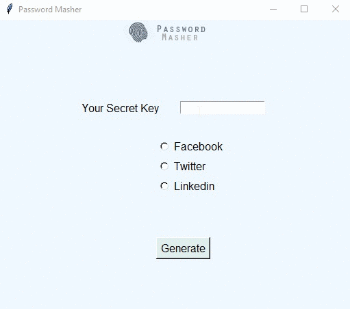

`Password Masher` is a utility tool developed using python, which converts your password into a strong password.

**About Password Masher**
---

There are many password generators available online. Most of them generate random strings as passwords which might be hard to remember and generated only once. To Overcome that problem I tried to create this tool.

The GUI Interface, is very simple. It consists of a secret Key - which you need to enter. This is the only thing which you need to remember. Once you enter the secret key select the website for which you need the password and click on generate.

Based on your secret key and webiste, it generates a complex password. The best part is that even if you forgets the password, you can rerun the tool and generate the same password again.

Periodically you can change your secret key and generate unique password for each sites.

**Features**
---

1. Generates complex passwords
2. Different password for each site based on Secret key
3. The character preferences can be modified in the code
4. More webistes can be added based on your preference
5. Password is auto copied into your clipboard
6. Runs on your local machine without any need for internet
7. No databases involved
8. easy set up

**Packages Used**
---

1. [`tkinter`](https://docs.python.org/3/library/tkinter.html)
     + `$ pip install tkinter`
2. [`PIL`](https://www.pythonware.com/products/pil/)
     + `$ pip install PIL`
3. [`pyperclip`](https://pypi.org/project/pyperclip/)
     + `$ pip install pyperclip`

**Installation Options**
---

1. Install the packages with [`pip`](https://pypi.org/)
      + `$ pip install tkinter`
      + `$ pip install PIL`
      + `$ pip install pyperclip`

2. Run the program using python

**How to Contribute**
---

1. Fork it (<https://github.com/akhilgeo/Password-Masher/fork>)
2. Create your feature branch
3. Commit your changes
4. Push to the branch
5. Create a new Pull Request
